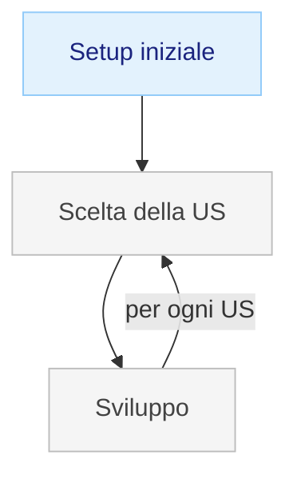

# Livello 1 — Sviluppo esplorativo

Scrivi codice direttamente dal requisito, senza documenti intermedi. Funziona bene per feature semplici e sessioni brevi, finché il progetto è piccolo e lo sviluppatore è l'unico che deve capirlo.

✅ **Funziona da solo.** Si può sviluppare tutto il progetto così. Il livello successivo serve se vuoi che le decisioni restino tracciate.

**Problema vissuto.** Dopo due o tre sessioni lo studente non ricorda l'ordine delle decisioni prese, perché aveva scelto una certa struttura, o cosa mancava ancora. Riaprire il progetto costa più del previsto.

---

## Processo



## Commit — `feat: GET /api/v1/books`

US-01: *come studente, voglio consultare il catalogo dei libri con titolo, autore e ISBN.*

File creati:
- `app/models/book.js` — schema Mongoose: title, author, isbn, genre, year, available
- `app/books.js` — route `GET /api/v1/books`, risponde con array e campo `self`
- `app/books.test.js` — test: `GET /api/v1/books` → 200 con array

File modificati:
- `index.js` — registrazione della route

```bash
git add app/models/book.js app/books.js app/books.test.js index.js
git commit -m "feat: GET /api/v1/books"
```

Il giorno dopo, per aggiungere US-02 (filtraggio per autore), devi rileggere il codice per ricordarti come hai strutturato il modello e perché. Senza un documento che tracci le decisioni, ogni sessione riparte da zero.

---

## Con OpenCode

Prompt per US-04 (nessun documento preparato):

```
Implementa l'endpoint per il prestito di un libro.
Un utente autenticato può prendere in prestito un libro
se è disponibile. Se il libro è già in prestito, restituisci
un errore appropriato.
Usa Express e Mongoose. Il modello Student esiste già.
```

Il codice funziona e i test passano. Il giorno dopo, per aggiungere US-06, OpenCode non ricorda nulla della sessione precedente — lo studente deve rileggere tutto il codice per ricostruire il contesto.
